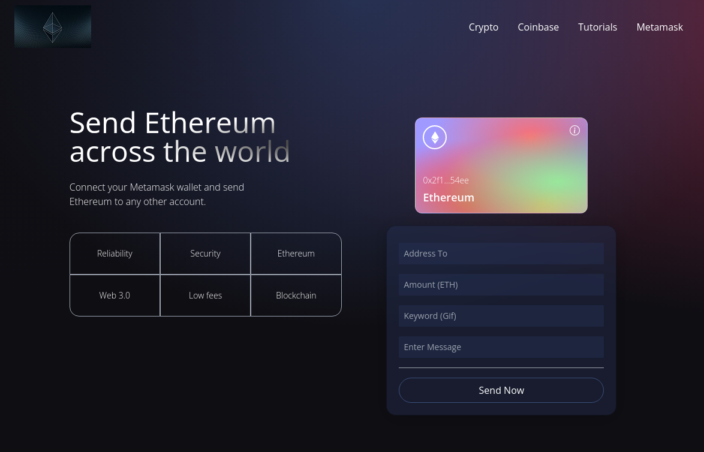

# Send Ethereum on Ropsten test network

>  It is a Vite React app using Metamask wallet, connected to the block-chain, interaction with smart contracts. Using Giphy API and styled with Tailwind CSS.

<!-- ## Mini Demo -->

## Live link

[Send Ethereum](https://send-ethereum.netlify.app/)

## Description

You can connect your Metamask account and use this app for sending transactions in ETH on the Ropsten test network from your connected account to any other account.

## Built With

- Major languages: Javascript, Solidity
- Frameworks: React.js, Vite, Tailwindcss
- Technologies used: Giphy, Metamask
- Testing: Hardhat

### Deployment

Using [Netlify](https://app.netlify.com/).

## Author

👤 **Yuriy Chamkoriyski**

- GitHub: [@Hombre2014](https://github.com/Hombre2014)
- Twitter: [@Chamkoriyski](https://twitter.com/Chamkoriyski)
- LinkedIn: [axebit](https://linkedin.com/in/axebit)

## 🤝 Contributing

Contributions, issues, and feature requests are welcome!

Feel free to check the [issues page](https://github.com/Hombre2014/space-travelers/issues).

## Show your support

Give a ⭐️ if you like this project!

## Acknowledgments

The [Creative Commons license of the design](https://creativecommons.org/licenses/by-nc/4.0/) requires appropriate credit to the author.
Original design idea by [Nelson Sakwa on Behance](https://www.behance.net/sakwadesignstudio).

## 📝 License

This project is [MIT](./license.md) licensed.